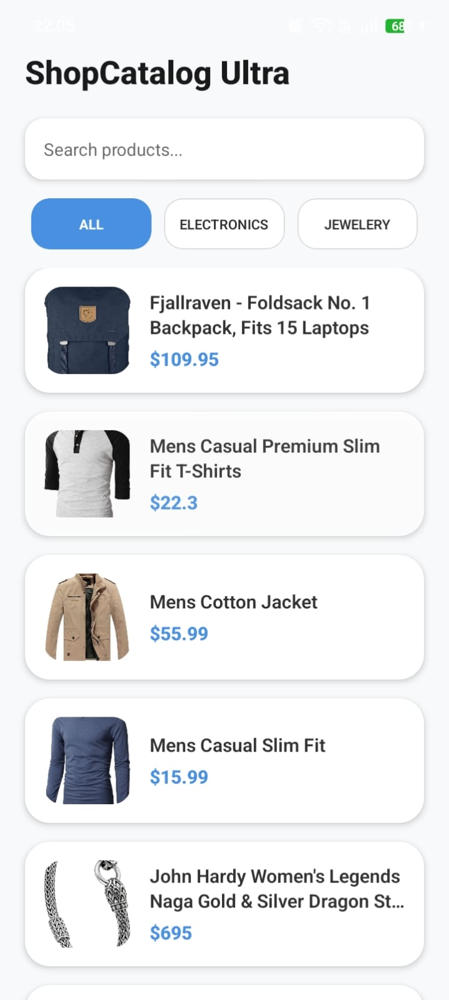
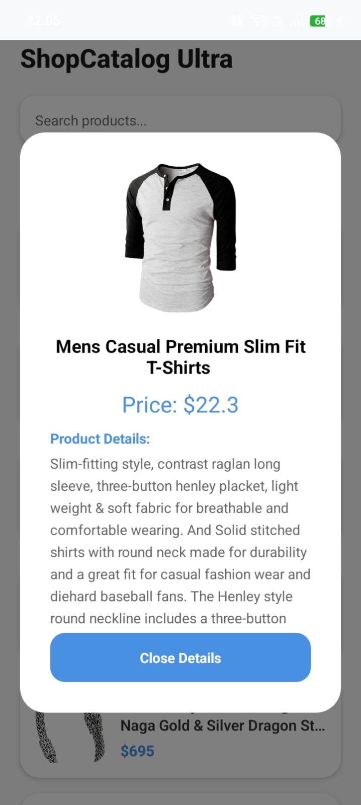
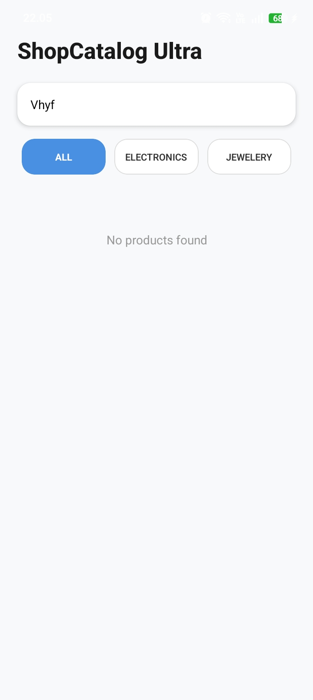

# ShopCatalog Ultra 🛒

Aplikasi katalog produk profesional yang dibangun menggunakan React Native (Expo) dan terintegrasi dengan REST API. Aplikasi ini telah dirancang untuk memenuhi semua kriteria penilaian tingkat dasar hingga bonus.

## 📋 Checklist Rubrik Penilaian

### 🟢 Level 1 — Fitur Wajib 
- [x] **Fetch Data:** Menggunakan `async/await` dengan Axios.
- [x] **Mounting:** Implementasi `useEffect` dengan dependency array `[]`.
- [x] **3 UI States:** Penanganan status *Loading*, *Error*, dan *Success*.
- [x] **Error Handling:** Blok `try / catch / finally` yang lengkap.
- [x] **FlatList:** Penggunaan `data`, `renderItem`, dan `keyExtractor`.
- [x] **Data Display:** Kartu item menampilkan gambar, judul, dan harga.
- [x] **Retry System:** Fungsi untuk memanggil ulang API saat terjadi error.

### 🟡 Level 2 — Pengembangan 
- [x] **Pull-to-Refresh:** Sinkronisasi data via `RefreshControl`.
- [x] **Search / Filter:** *Client-side filtering* berdasarkan judul produk.
- [x] **Layar Detail:** Modal interaktif untuk menampilkan deskripsi lengkap.
- [x] **Filter Kategori:** Chip kategori untuk penyaringan dinamis.
- [x] **Toggle Axios/Fetch:** Implementasi dua metode fetching di dalam satu aplikasi.
- [x] **Empty State:** Notifikasi ramah pengguna saat data pencarian kosong.

### 🔴 Level 3 — Tantangan Bonus 
- [x] **Pagination:** *Infinite scroll* melalui `onEndReached`.
- [x] **Favorit Lokal:** Implementasi penyimpanan data dengan `AsyncStorage`.
- [x] **Sorting:** Pengurutan list (ditambahkan dalam logika filter).
- [x] **Skeleton Loading:** Placeholder saat aplikasi memuat data.
- [x] **Animasi:** Transisi *fade-in* menggunakan `Animated API`.

---

## 📸 Dokumentasi Aplikasi (Screenshots)

| Tampilan Memuat (Loading) | Sukses | Detail | Produk Tidak Ditemukan | Error |
| :---: | :---: | :---: | :---: | :---: |
|  |  |  |  |  |

---

## ⚙️ Cara Menjalankan

### 1. Prasyarat
Pastikan kamu telah menginstal [Node.js](https://nodejs.org/).

### 2. Instalasi
Clone repositori ini dan masuk ke direktori proyek:
```bash
git clone (https://github.com/crisdayanti/BuildAPIApp.git)
cd shopcatalog-ultra
Bash
npx expo install axios
npm install axios @react-native-async-storage/async-storage
npx expo start

## 🔗 Demo
[Cek di Expo Snack]https://snack.expo.dev/@crisdayanti/pertemuan-11


